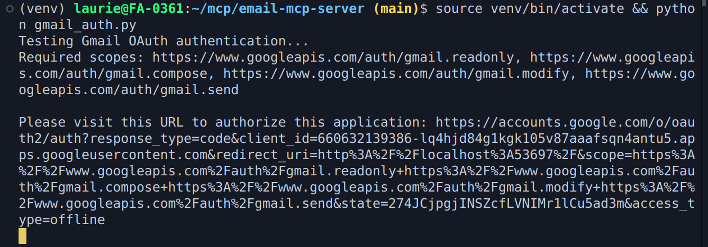
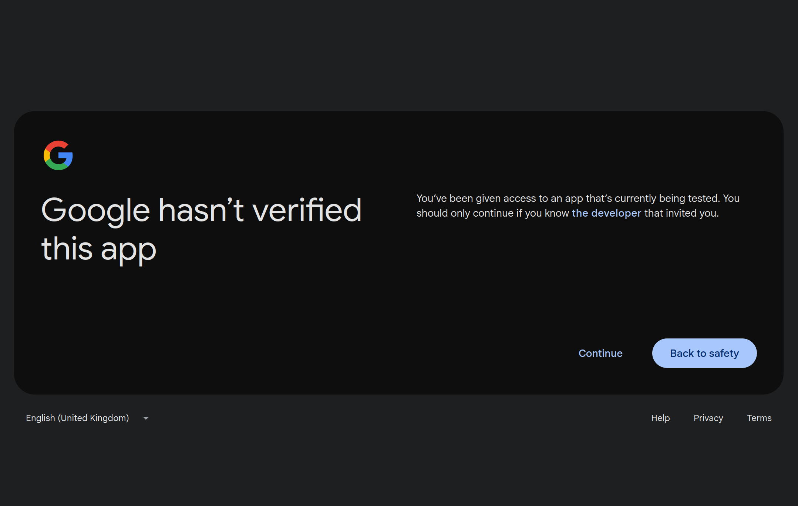
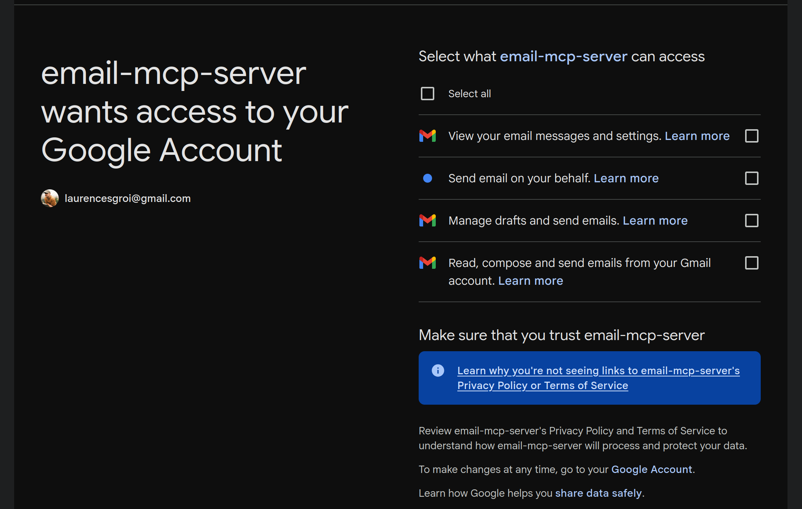
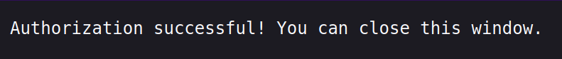

# Google OAuth 2.0 Setup Guide

This guide walks you through setting up Google OAuth 2.0 credentials for the Email MCP Server.

## Prerequisites

- Google account
- Access to [Google Cloud Console](https://console.cloud.google.com/)

## Step 1: Create Google Cloud Project

1. Go to [Google Cloud Console](https://console.cloud.google.com/)
2. Create a new project or select an existing one
3. Enable the Gmail API:
   - Navigate to **APIs & Services > Library**
   - Search for "Gmail API"
   - Click **Enable**

## Step 2: Configure OAuth Consent Screen

1. Go to **APIs & Services > OAuth consent screen**
2. Choose **External** user type (or **Internal** if using Google Workspace)
3. Fill in the required fields:
   - **App name**: "Email MCP Server" (or your preferred name)
   - **User support email**: Your email address
   - **Developer contact**: Your email address
4. Click **Save and Continue**

## Step 3: Add OAuth Scopes

1. On the Scopes page, click **Add or Remove Scopes**
2. Add these scopes:
   - `https://www.googleapis.com/auth/gmail.readonly` - Read emails
   - `https://www.googleapis.com/auth/gmail.compose` - Create drafts
   - `https://www.googleapis.com/auth/gmail.modify` - Modify emails
   - `https://www.googleapis.com/auth/gmail.send` - Send emails
3. Click **Update** and **Save and Continue**

## Step 4: Add Test Users

1. On the Test users page, click **+ ADD USERS**
2. Add your Gmail address
3. Click **Save**

## Step 5: Create OAuth Credentials

1. Go to **APIs & Services > Credentials**
2. Click **Create Credentials > OAuth client ID**
3. Choose **Desktop app** as the application type
4. Enter a name (e.g., "Email MCP Client")
5. Click **Create**
6. Download the credentials JSON file
7. Save it as `credentials.json` in the project directory

## Step 6: Authenticate

Run the authentication script to complete the OAuth flow:

```bash
cd email-mcp-server
source venv/bin/activate  # On Windows: venv\Scripts\activate
python gmail_auth.py
```

This will:
1. Open your browser for Google sign-in
2. Ask you to authorize the app
3. Save a `token.json` file with your credentials


*Screenshot: Testing the authentication flow*


*Screenshot: Google OAuth authorization screen in browser*


*Screenshot: "Google hasn't verified this app" warning*


*Screenshot: Allow access*


*Screenshot: Successful authentication*

## Important Security Notes

- **Never commit** `credentials.json` or `token.json` to version control (they're in `.gitignore`)
- The `token.json` file contains your refresh token and will be used automatically by the MCP server
- You won't need to re-authenticate unless you revoke access or delete this file
- Revoke access anytime from your [Google Account Permissions](https://myaccount.google.com/permissions)

## Troubleshooting

**"Access blocked: email-mcp-server has not completed the Google verification process"**
- Make sure you've added yourself as a test user in the OAuth consent screen (Step 4)

**"Google hasn't verified this app" warning**
- This is normal for apps in testing mode
- Click **"Advanced"** → **"Go to email-mcp-server (unsafe)"** to proceed
- For personal use only, this is perfectly safe

For more troubleshooting tips, see the [Troubleshooting Guide](troubleshooting.md).
