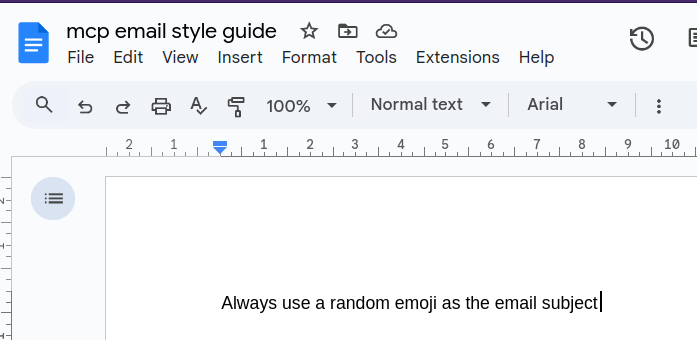
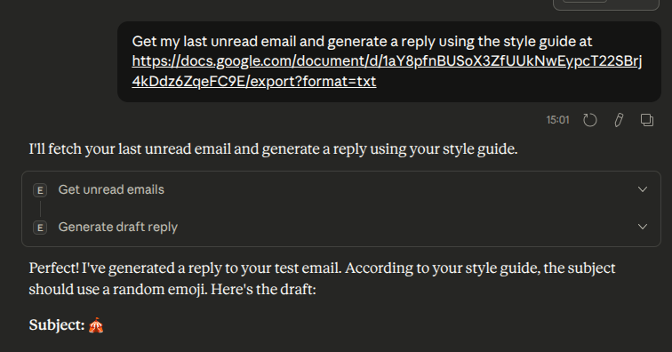

# Style Guide Feature

## Overview

The Email MCP Server now supports pulling external email style guides to help Claude generate better, more consistent email replies. This implements the stretch goal of enhancing the server with external context.

## How It Works

1. **Fetch**: The server fetches style guide content from any publicly accessible URL
2. **Cache**: Style guides are cached for 1 hour to improve performance and reduce network requests
3. **Apply**: When generating replies, Claude uses the style guide to ensure consistent tone, formatting, and messaging

## Usage

### With Google Docs

1. Create your email style guide in Google Docs
2. Make the document publicly viewable (Share > Anyone with the link can view)
3. Use the export URL format:

   ```
   https://docs.google.com/document/d/YOUR_DOCUMENT_ID/export?format=txt
   ```

   
   *Screenshot: The style guide document*

### In Claude Desktop

Simply mention the style guide URL when asking Claude to generate a reply:

```
"Generate a reply to this email using the style guide at
https://docs.google.com/document/d/YOUR_DOC_ID/export?format=txt"
```

   
   *Screenshot: Using the style guide*

Claude will automatically:

- Fetch the style guide (or use cached version)
- Apply the guidelines when drafting the reply
- Indicate that a style guide was used

## Technical Details

### Implementation

- **Function**: `fetch_style_guide(url: str)` - Fetches and caches style guide content
- **Cache Duration**: 1 hour (configurable via `style_guide_cache['cache_duration']`)
- **Parameter**: `style_guide_url` (optional) added to `generate_draft_reply` tool
- **Dependencies**: Requires `requests` library (added to requirements.txt)

### Supported URL Formats

- Google Docs export URLs (plain text)
- Any publicly accessible URL returning text content
- Plain text files hosted on web servers
- Markdown files (rendered as plain text)

### Error Handling

If the style guide cannot be fetched:

- The system continues without it
- A note is logged but the reply generation proceeds
