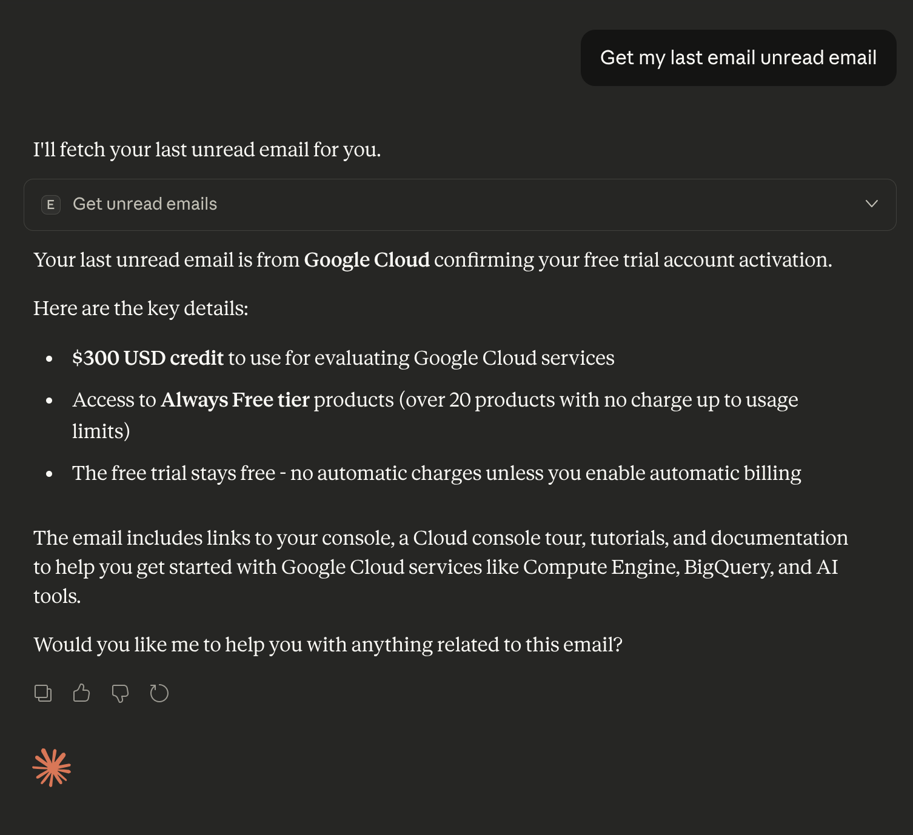
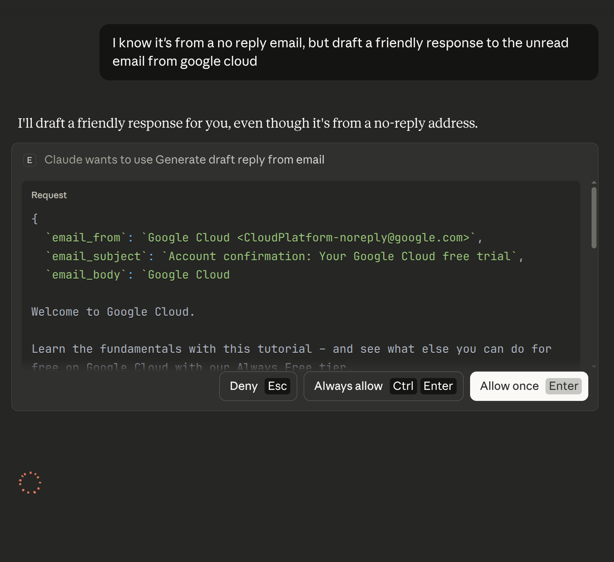
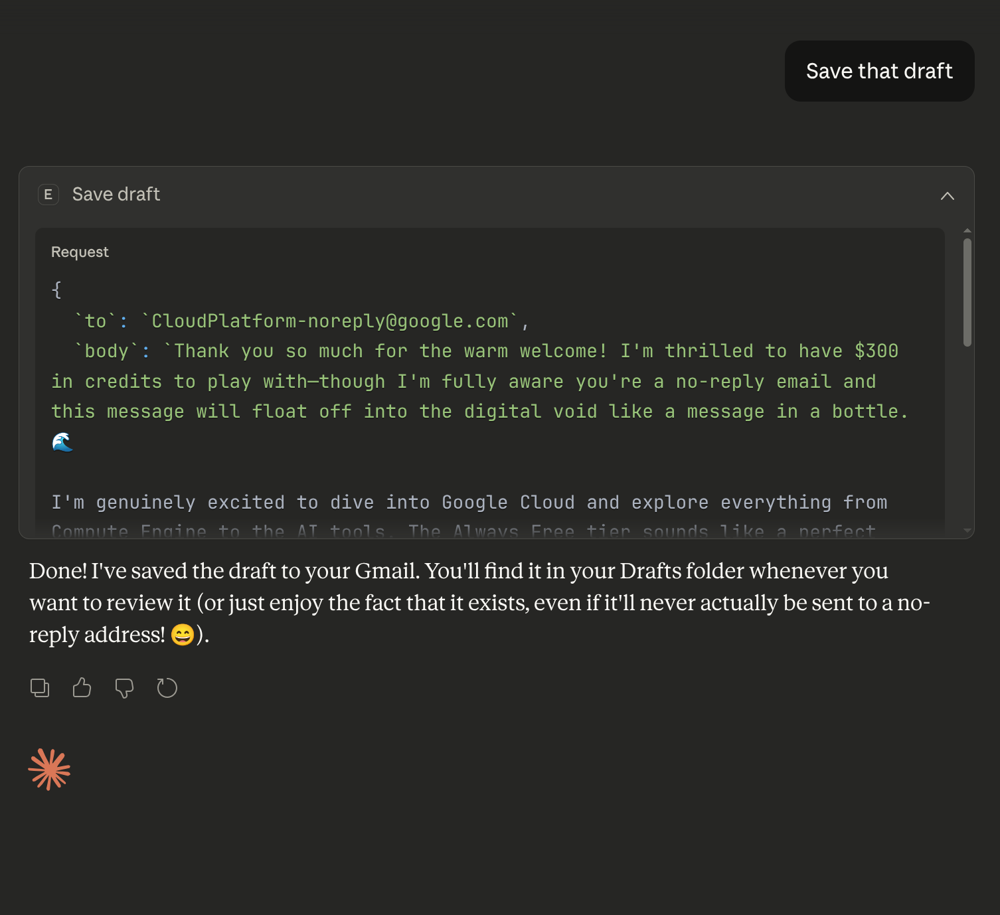
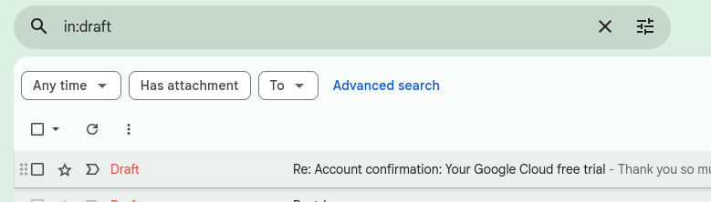
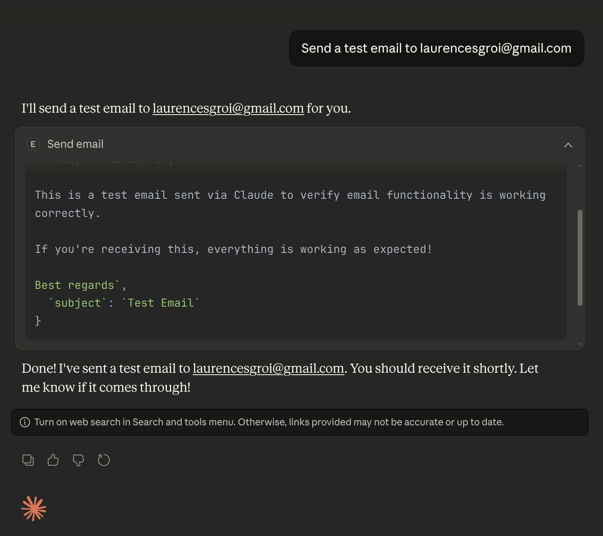
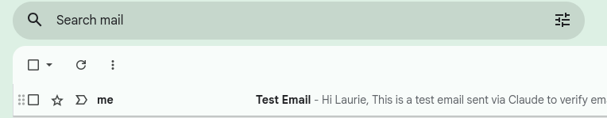

# Usage Examples with Claude Desktop

This guide demonstrates how to use the Email MCP Server with Claude Desktop through natural language prompts.

## Prerequisites

- Completed [OAuth setup](oauth-setup.md)
- Claude Desktop installed and configured
- Email MCP Server configured in Claude Desktop settings

## Example Workflows

### 1. Check Unread Emails

You can ask Claude to fetch your unread emails using natural language:

**Example Prompts:**
- "Show me my unread emails"
- "What are my latest 5 unread emails?"
- "Check my inbox for unread messages"

*Screenshot: Claude fetching last unread email using the get_unread_emails tool*

### 2. Generate Draft Replies

Claude can generate contextual, AI-powered replies to your emails:

**Example Prompts:**
- "Generate a professional reply to the first email"
- "Draft a friendly response to the email from [sender]"

*Screenshot: Claude generating an AI-powered draft reply*

### 3. Save Drafts to Gmail

Once you're happy with a draft, you can save it directly to Gmail:

**Example Prompts:**
- "Save that reply as a draft in Gmail"
- "Create a draft reply to [sender] about [topic]"

*Screenshot: Claude saving a draft to Gmail*

*Screenshot: Draft appearing in Gmail Drafts folder*

### 4. Send Emails

You can send emails immediately without saving as a draft:

**Example Prompts:**
- "Send an email to john@example.com with subject 'Meeting Follow-up' saying I'll send the report by Friday"
- "Send that email to [recipient]"

*Screenshot: Claude sending an email using the send_email tool*

*Screenshot: Email appearing in inbox*

